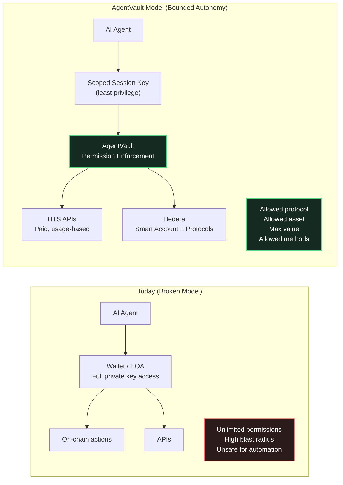
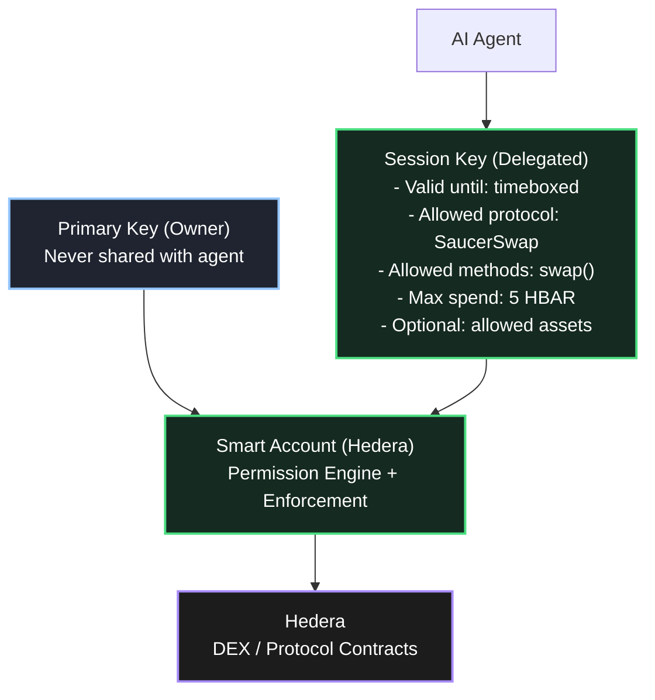
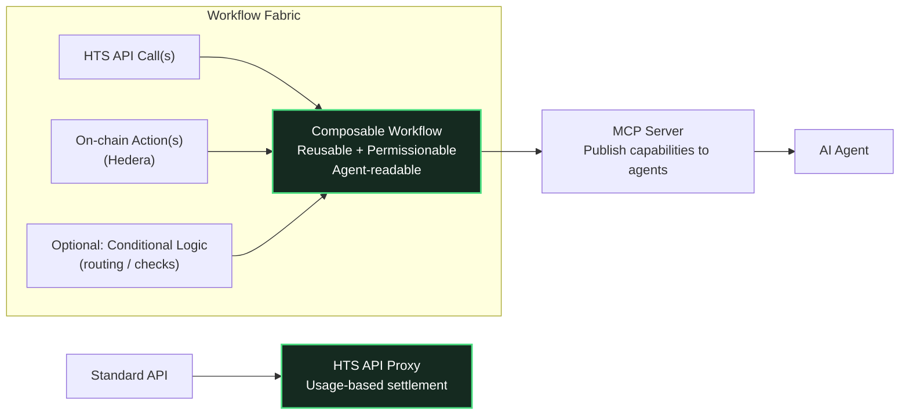
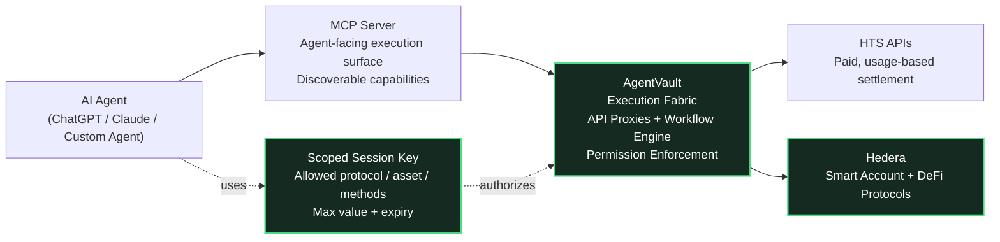

# AgentVault

**Agents with limits.**

> **Hedera Hello Future Apex Hackathon 2026** — AI & Agents Track

## Hackathon Submission

| | |
|---|---|
| **Live Demo** | [agentvault.tools](https://agentvault.tools) |
| **Pitch Deck** | [View HTML](/apps/web/public/pitch-deck.html) · [Download PDF](https://agentvault.tools/pitch-deck.html) |
| **Demo Video** | [YouTube](https://youtube.com) *(link TBD)* |
| **Smart Contract** | [`0x624f7c953dac044f3a38e7230c16f410cf7301d2`](https://hashscan.io/testnet/contract/0x624f7c953dac044f3a38e7230c16f410cf7301d2) |
| **Track** | AI & Agents |
| **Bounty** | Hashgraph Online |
| **Developer** | Jeremi Carose |

### Project Description (100 words)

AgentVault is an agent-native execution fabric on Hedera that enables AI agents to safely interact with paid APIs and on-chain workflows using scoped, programmable permissions. Instead of sharing private keys, agents operate via session keys with explicit limits on protocols, assets, methods, and values. The platform includes a services marketplace, composable workflow engine, MCP server integration, and HCS-based audit trails. Smart contracts deployed on Hedera Testnet enforce session permissions on-chain, while HCS-10 provides agent identity registration. AgentVault delivers autonomous execution without autonomous risk — making Hedera a safe execution environment for AI agents.

---

AgentVault is an agent-native execution fabric that enables AI agents to safely interact with paid APIs and on-chain workflows on Hedera, using scoped, programmable permissions.

Agents never access a user's primary private key.
Instead, they operate via session keys with explicit, enforceable limits — such as which protocol, which asset, and how much value they are allowed to use.

---

## What AgentVault Enables

- AI agents that can execute on-chain actions safely
- HTS-native APIs with usage-based settlement
- Composable workflows combining APIs + smart contracts
- MCP servers for agent discovery and interaction
- Bounded autonomy via scoped session permissions

AgentVault turns APIs and workflows into agent-readable economic primitives, without sacrificing custody or control.

---

## Why AgentVault Exists

AI agents are becoming capable of real financial decision-making — but today's execution models are broken:

- Agents either cannot act at all, or
- They require full access to private keys, creating unacceptable risk

This tradeoff blocks adoption of agentic finance.

AgentVault solves this by introducing a permissioned execution layer:

- autonomy without custody
- composability without danger
- automation without hot wallets

---

## Core Architecture

AgentVault is built around five core primitives:

### 1. Smart Account Upgrade

A standard EOA is upgraded into a smart account capable of enforcing:

- session keys
- scoped permissions
- bounded execution

The primary key is never shared.

---

### 2. Scoped Session Keys

Session keys define exactly what an agent can do, including:

- allowed contracts / protocols
- permitted assets
- maximum value
- specific methods (e.g. swap only)

This follows the principle of least privilege.

---

### 3. HTS API Proxies

Any API can be wrapped as an HTS-compatible, usage-based endpoint, allowing:

- programmatic payment
- agent-native consumption
- composable economic primitives

---

### 4. Workflow Fabric

Multi-step workflows combine:

- HTS API calls
- on-chain actions
- conditional logic

Workflows are reusable, permissionable, and agent-readable.

---

### 5. MCP Servers

Selected APIs and workflows are exposed as MCP servers, enabling:

- agent discovery
- standardized invocation
- safe execution surfaces for AI systems like ChatGPT and Claude

---

## End-to-End Flow (High Level)

1. A developer or user defines APIs and workflows
2. A smart account is deployed or upgraded
3. A scoped session key is generated for an agent
4. APIs and workflows are exposed via an MCP server
5. The agent discovers, reasons, and executes within strict boundaries
6. Transactions settle on Hedera using HTS-compatible flows

**Result:** autonomous execution without autonomous risk.

---

## Demo Scenario

In the demo, AgentVault shows an AI agent performing the following task:

> "Find the top trending token on Hedera today and buy 5 HBAR worth of it."

Using AgentVault, the agent:

1. Queries a paid HTS API for trending tokens
2. Selects the top result
3. Executes a swap via a prebuilt SaucerSwap DEX aggregation workflow
4. Settles the transaction on Hedera

At no point does the agent access the user's private key.
All actions are executed within scoped permissions.

---

## Built for Hedera

AgentVault is:

- deployed on Hedera
- designed for HTS-style programmatic payments
- compatible with Hedera ecosystem tooling
- aligned with agentic finance and AI-native infrastructure

This makes Hedera a safe, first-class execution environment for AI agents.

---

## Use Cases

- Agent-triggered DeFi actions
- Automated portfolio management
- Risk-bounded trading bots
- Paid API access for AI agents
- Agent-readable developer tooling
- Institutional-grade agent workflows

---

## Hackathon Tracks

AgentVault qualifies for:

- Hedera Hello Future Apex Hackathon 2026
- Agentic Finance Track
- Dev Tooling & Infrastructure Track

---

## License

MIT

---

## Links

- Website: https://agentvault.tools
- Source Code: https://github.com/Jeremicarose/Agent-Vault
