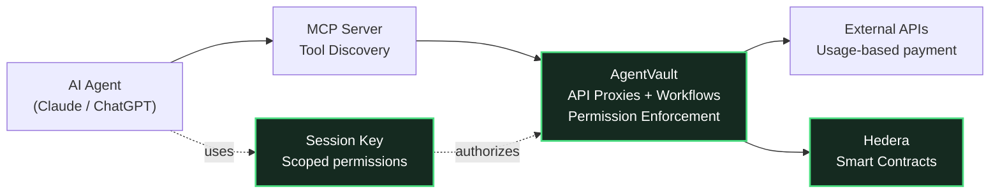

# AgentVault

**Agents with limits.**

> **Hedera Hello Future Apex Hackathon 2026** — AI & Agents Track

## Hackathon Submission

| | |
|---|---|
| **Live Demo** | [agent-vault-web.vercel.app](https://agent-vault-web-jeremicaroses-projects.vercel.app) |
| **Demo Video** | [YouTube](https://youtube.com) *(link TBD)* |
| **Smart Contract** | [`0x624f7c953dac044f3a38e7230c16f410cf7301d2`](https://hashscan.io/testnet/contract/0x624f7c953dac044f3a38e7230c16f410cf7301d2) |
| **Track** | AI & Agents |
| **Bounty** | Hashgraph Online |
| **Developer** | Jeremi Carose |

### Project Description (100 words)

AgentVault is an agent-native execution fabric on Hedera that enables AI agents to safely interact with paid APIs and on-chain workflows using scoped, programmable permissions. Instead of sharing private keys, agents operate via session keys with explicit limits on protocols, assets, methods, and values. The platform includes a services marketplace, composable workflow engine, MCP server integration, and HCS-based audit trails. Smart contracts deployed on Hedera Testnet enforce session permissions on-chain, while HCS-10 provides agent identity registration. AgentVault delivers autonomous execution without autonomous risk — making Hedera a safe execution environment for AI agents.

---

## Tech Stack

| Layer | Technology |
|---|---|
| **Blockchain** | Hedera Testnet (EVM-compatible), Solidity smart contracts |
| **Smart Contracts** | AgentDelegator (ERC-7702 smart accounts, session keys), deployed via Hardhat |
| **Consensus** | Hedera Consensus Service (HCS) for immutable audit trails, HCS-10 agent identity |
| **Frontend** | Next.js 16, React 19, TailwindCSS, shadcn/ui |
| **Backend** | Next.js API routes, Drizzle ORM, PostgreSQL (Neon) |
| **Wallet** | Reown AppKit + SIWX (Sign-In With eXtendable), MetaMask |
| **AI Integration** | Model Context Protocol (MCP) server, stdio transport |
| **Cryptography** | RSA+AES hybrid encryption for API credentials, EIP-712 typed signatures |
| **Deployment** | Vercel (web app), pnpm monorepo |
| **Languages** | TypeScript, Solidity |

---

## Repository Structure

```
agent_vault/
├── apps/
│   ├── web/                    # Next.js web application
│   │   ├── app/                # App router pages & API routes
│   │   ├── features/           # Feature modules (proxy, workflows, authorization)
│   │   ├── lib/                # Shared utilities (db, auth, crypto, session keys)
│   │   └── scripts/            # Database seed scripts
│   └── mcp-server/             # MCP server (stdio + HTTP transports)
│       └── src/
│           ├── stdio-bridge.ts # Stdio MCP bridge for Claude Code
│           ├── server.ts       # HTTP MCP server with OAuth
│           ├── tools/          # Tool registry & proxy tools
│           ├── hcs/            # HCS audit trail & agent identity
│           ├── payment/        # Payment signing via session keys
│           └── auth/           # OAuth 2.1 provider
├── hardhat/                    # Smart contract development
│   └── contracts/
│       └── AgentDelegator.sol  # Session key + smart account contract
└── packages/                   # Shared packages
```

---

## What AgentVault Enables

- **Services Marketplace** — Browse, create, and monetize API proxies with usage-based pricing
- **Composable Workflows** — Chain API calls + on-chain actions into reusable automations
- **MCP Server Integration** — Expose tools to AI agents (Claude, ChatGPT) via Model Context Protocol
- **Bounded Autonomy** — Scoped session keys limit what agents can do (contracts, methods, values, time)
- **Immutable Audit Trail** — Every agent action logged to HCS for verifiable transparency
- **Smart Account Upgrade** — EOAs upgraded to smart accounts via ERC-7702 delegation

---

## Core Architecture



### How It Works

1. **User creates API services** — Wrap any API with payment, variables, and encrypted credentials
2. **User builds workflows** — Combine HTTP calls + on-chain transactions with data flow
3. **User configures MCP server** — Select which tools to expose to AI agents
4. **AI agent discovers tools** — Claude/ChatGPT connects via MCP and sees available capabilities
5. **Agent executes within bounds** — Session key enforces what the agent can access
6. **Actions are audited** — HCS logs every tool invocation with timestamps

---

## Setup & Testing Instructions

### Prerequisites

- Node.js 20+
- pnpm 9+
- MetaMask browser extension
- Claude Code CLI (for MCP testing)

### 1. Clone & Install

```bash
git clone https://github.com/Jeremicarose/Agent-Vault.git
cd Agent-Vault
pnpm install
```

### 2. Environment Setup

```bash
cp apps/web/.env.example apps/web/.env.local
cp apps/mcp-server/.env.example apps/mcp-server/.env.local
```

Edit `apps/web/.env.local`:
```env
DATABASE_URL=<your-postgresql-url>
NEXT_PUBLIC_REOWN_PROJECT_ID=<from-cloud.reown.com>
SESSION_SECRET=<openssl-rand-base64-32>
```

Edit `apps/mcp-server/.env.local`:
```env
DATABASE_URL=<same-postgresql-url>
NEXT_APP_URL=http://localhost:3000
```

### 3. Database Setup

```bash
cd apps/web
pnpm db:push      # Create tables
pnpm db:seed      # Seed demo data (Token Price API + workflow)
```

### 4. Start the Application

```bash
# Terminal 1: Start the web app
pnpm dev:web

# Terminal 2: Start the MCP server (stdio mode for Claude Code)
pnpm dev:mcp
```

### 5. Test the Web Application

1. Open http://localhost:3000 — redirects to the Services Marketplace
2. **Connect Wallet** — Click "Connect Wallet", select MetaMask, sign the SIWX message
3. **Browse Services** — See Token Price API and Hedera Account Balance services
4. **Try a Service** — Click on Token Price API → "Make Request" → see live CoinGecko data
5. **Create a Service** — Go to Dashboard → Create a new API proxy
6. **Build a Workflow** — Go to Workflows → Create an automation chaining API + on-chain steps
7. **Configure AI Agent** — Go to Dashboard → AI Agent Hub → Create MCP server, assign tools

### 6. Test MCP Integration with Claude

```bash
# Add the AgentVault MCP server to Claude Code
claude mcp add agentvault -- \
  npx tsx apps/mcp-server/src/stdio-bridge.ts my-agent

# Start Claude Code
claude

# Ask Claude to use AgentVault tools:
> "Use the token_price_api tool to get the current price of HBAR"
> "Use hedera_account_balance to look up account 0.0.98"
> "Get the price of bitcoin and ethereum, then check account 0.0.1234"
```

Claude will discover the tools via MCP, call the AgentVault proxy, which fetches real data from CoinGecko and Hedera Mirror Node.

### 7. Test on Production

Visit the live deployment: https://agent-vault-web-jeremicaroses-projects.vercel.app

1. Connect MetaMask (Hedera Testnet)
2. Get testnet HBAR from https://portal.hedera.com/faucet
3. Browse and test services in the marketplace

---

## Smart Contract

**AgentDelegator** — deployed on Hedera Testnet at [`0x624f7c953dac044f3a38e7230c16f410cf7301d2`](https://hashscan.io/testnet/contract/0x624f7c953dac044f3a38e7230c16f410cf7301d2)

Features:
- ERC-7702 smart account upgrade (EOA → smart account)
- Session key management (grant, revoke, validate)
- Scoped permissions (allowed targets, selectors, time bounds)
- EIP-712 typed data for session signatures
- EIP-1271 signature validation for off-chain operations

---

## Demo Scenario

In the demo, an AI agent (Claude) interacts with Hedera through AgentVault:

1. **Discovers tools** — Claude connects via MCP and sees `token_price_api` and `hedera_account_balance`
2. **Fetches live data** — Calls CoinGecko for HBAR price and Mirror Node for account balances
3. **Reasons over results** — Analyzes price data, calculates portfolio values
4. **Executes workflows** — Chains API calls with on-chain actions (price check → transfer)

All actions are bounded by session key permissions. No private keys are shared. Every action is logged to HCS.

---

## Key Differentiators

| Feature | Description |
|---|---|
| **Zero Key Sharing** | Agents use scoped session keys, never the owner's private key |
| **Composable Execution** | Mix HTTP APIs + smart contract calls in single workflows |
| **MCP Native** | First-class Model Context Protocol support for Claude & ChatGPT |
| **HCS Audit Trail** | Immutable, verifiable log of every agent action on Hedera |
| **Usage-Based Payments** | APIs priced per-request with HTS-compatible settlement |
| **Visual Builder** | No-code workflow editor with drag-and-drop step configuration |

---

## License

MIT

---

## Links

- Live Demo: https://agent-vault-web-jeremicaroses-projects.vercel.app
- Source Code: https://github.com/Jeremicarose/Agent-Vault
- Smart Contract: https://hashscan.io/testnet/contract/0x624f7c953dac044f3a38e7230c16f410cf7301d2
